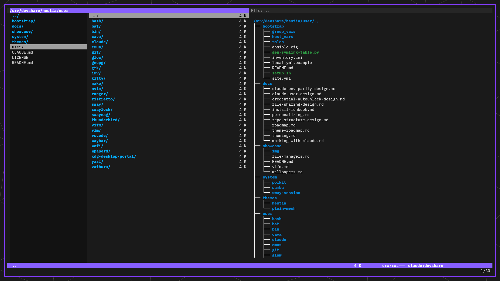
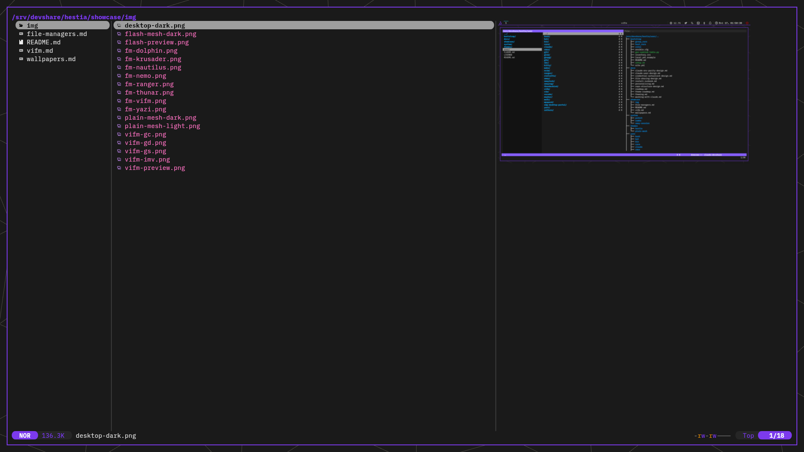
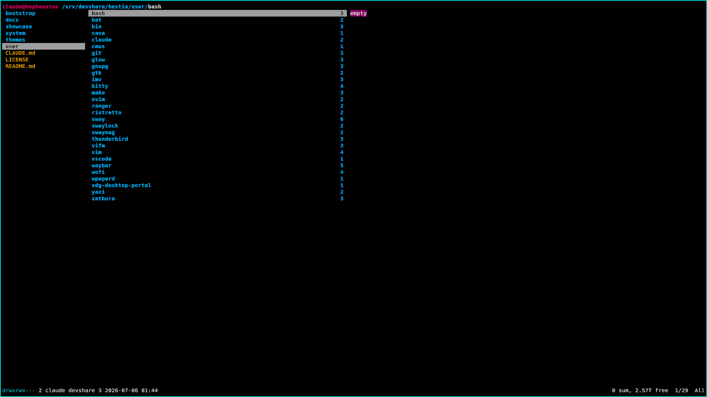
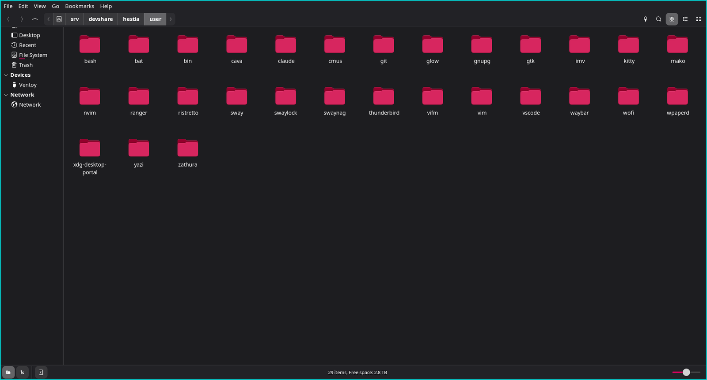
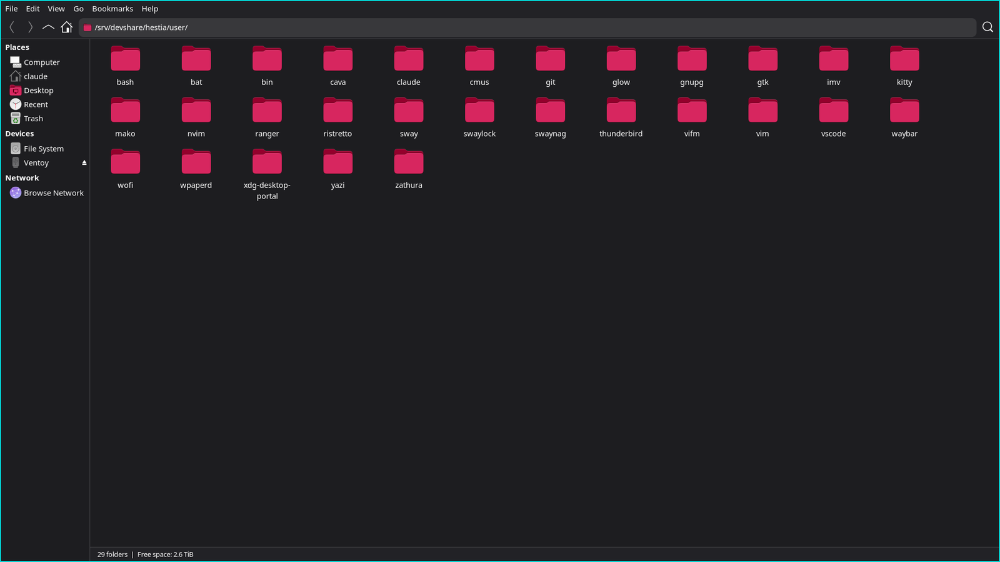
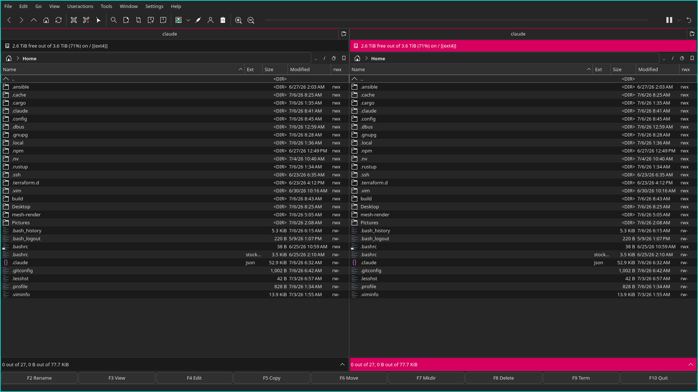
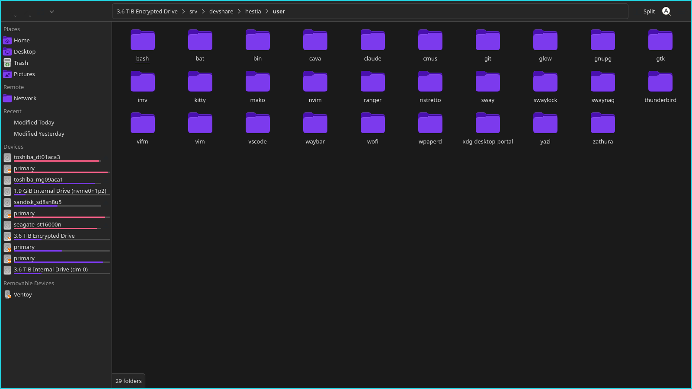
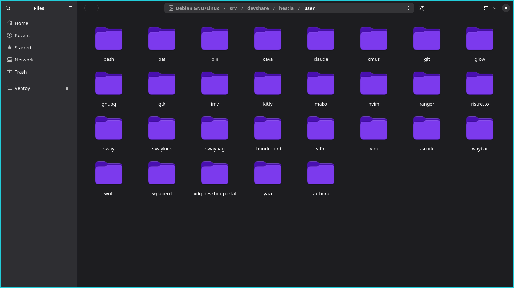

# File managers: seven contenders against an incumbent that fought back

hestia's file manager has always been **vifm** — not as a default that nobody
questioned, but as an accumulation of deep integrations: a vim-grade config,
a git suite wired into the browser, and a client-server protocol that other
tools script against. By mid-2026 the question was worth asking properly:
has the field moved? Terminal managers with GPU-drawn previews (yazi) and a
new generation of GUI managers deserved a fair trial — and a spin needs a
GUI file manager story anyway, for the days when drag-and-drop is simply the
right tool. So seven contenders went in behind one toggle, *alongside* the
incumbent, never replacing it.

## The contenders

| App | Kind | Verdict |
|---|---|---|
| **vifm** | terminal (incumbent) | **stays the primary** — the vim of file managers: lean, decades-proven, packaged everywhere; its integrations are load-bearing (bias admitted — years of muscle memory) |
| **yazi** | terminal, Rust | fast, and ships out of the box what the ranger + ueberzug era needed real configuration for; kept as the rich-preview lane |
| **ranger** | terminal, Python | the baseline TUI; mature, slower — its best ideas got absorbed instead |
| **nemo** | GUI, GTK3 | **the intended default GUI manager** (`xdg-mime` wiring lands when the trial concludes) |
| **thunar** | GUI, GTK3 | solid, lighter than nemo; kept as the alternative |
| **nautilus** | GUI, GTK4/libadwaita | the live test target for the staged GTK4 accent — dark yes, accent locked until Debian 14 |
| **krusader** | GUI, KDE/KF6 | the twin-panel power tool; earned its keep by forcing the Qt theming fix |
| **dolphin** | GUI, KDE/KF6 | KDE's flagship; rides the same Qt fix |

One structural note: **yazi isn't in Debian at all** — it installs as a
pinned, sha256-verified GitHub release binary, and teaching the installer to
do that cleanly (archives whose inner paths embed the CPU architecture,
per-entry feature gating) became reusable plumbing that later delivered the
entire wallpaper tool stack.

## The ride

**The incumbent's moat turned out to be integration, not features.** vifm's
git suite (`:gc` lists exactly the files a branch changed as a jump list,
`:gs` highlights them inline, `:gd` diffs the cursor file against the branch
base) and its `--remote` client-server — which the imv image-browsing
integration scripts against — are things no challenger replicates without
years of config. That was the frame going in: challengers had to beat vifm
*plus* its wiring, not vifm alone.

**yazi made the strongest case.** It's fast, and it ships *out of the box*
what the previous terminal generation had to assemble by hand: in the
ranger + ueberzug era, image previews in a terminal file manager meant an
X11-bound shim and a decent amount of configuration to get right — yazi
speaks the kitty graphics protocol natively and previews asynchronously,
zero setup. That's precisely the gap that forced hestia's elaborate
vifm↔imv side-window integration (vifm's preview pane can't render kitty
graphics; that experiment failed twice before the side-window design).
Async I/O means no UI stalls on slow Samba or Tailscale mounts, and a Lua
plugin ecosystem moves fast.

The verdict, then, is a trade — the same one vim users make when they stay
on vim rather than Neovim. vifm plus its scripts sacrifices some
out-of-the-box features and convenience for speed and total control, and
after years of daily driving, the keystrokes-to-done comparison favoured the
incumbent decisively ("very, very, very faster" was the live assessment).
Bias is involved — years of vifm muscle memory don't judge fairly, and this
chapter says so. But one argument for vifm needs no fairness: the project is
old, still actively maintained, and packaged in nearly every distro
repository. Like vim, you can land on almost any box and find it — and for
a tool you make muscle memory of, being everywhere is a feature.

**The trial's best outcome: the incumbent stole from the challengers.**
Living with ranger and yazi made one thing obvious — the *parent | current |
preview* triple layout genuinely orients you. Rather than switching tools,
vifm gained **miller columns** (`set millerview`, a slim parent-context
column) and its directory preview was upgraded to a coloured `tree -C`
driven by the same `LS_COLORS` as `ls` — so with the quick-view pane on,
vifm now reads as the ranger triple, with vifm's speed. The evaluation
improved the winner instead of replacing it.

**The GUI half had a different job**: pick the everyday graphical manager
for the spin. **nemo** won the nod (pending the final `xdg-mime` wiring) —
GTK3, so hestia's recoloured theme and `#d7005f` Yaru-hestia folders apply
on launch, with thunar as the lighter alternative.

**The KDE pair earned its keep by breaking.** krusader and dolphin launched
as dark-Fusion-with-blue-highlights — the Hestia `kdeglobals` colour scheme
that already themed Kdenlive was being ignored. The lesson (now permanent in
the theming system): KDE apps that don't self-apply schemes need **two**
pieces — the scheme pre-selected in their rc files *and* a Qt platform theme
(`plasma-integration` + `QT_QPA_PLATFORMTHEME=kde`) — because without a
platform theme, a KDE app never reads `kdeglobals` at all. As a side effect,
bare-Qt apps now theme too — a whole deferred work track resolved by a trial
failure.

**nautilus documents the one wall hestia can't climb yet.** It's
GTK4/libadwaita: dark mode follows the portal, but libadwaita 1.7 locks its
accent against user CSS — so its chrome keeps the stock blue until Debian 14
ships libadwaita ≥ 1.8, where hestia's already-staged `gtk-4.0/gtk.css`
accent activates by itself. Meanwhile the Yaru-hestia folders still land —
icons are just files, immune to the lock. The screenshot is the honest
state: dark, accent-locked chrome, hestia-red folders.

## How hestia ships it

- **vifm always** — it's core (`terminal` apt group), with its colorscheme,
  git suite, preview script, and imv integration under `user/vifm/`
- The trial set rides **`enable_file_managers`** (default off): the
  `file_managers` apt group + the yazi/ya `localbin` entries
- **All eight are themed**: yazi and ranger have **generated** wildcharm
  pairs (same render pipeline as everything else — their file-type colours
  come from the same table as vifm's and `ls`'s, so all four agree by
  construction); the GTK trio follows the hestia theme; the KDE pair reads
  the generated `kdeglobals`
- Still open: trimming the set to the keepers and wiring
  `xdg-mime default nemo.desktop inode/directory` when the trial concludes

## Gotchas, for the record

- **A KDE app that ignores your colour scheme needs a platform theme** —
  without `plasma-integration` + `QT_QPA_PLATFORMTHEME=kde`, KF6 apps never
  read `kdeglobals`; pre-selecting the scheme in their rc files alone does
  nothing. Symptom: dark Fusion with blue highlights.
- **libadwaita 1.7 accents are locked** against user CSS — but icon themes
  are immune (they're just files). Stage the ≥ 1.8 CSS now; it activates on
  the Debian 14 upgrade.
- **In-pane graphics in vifm don't work** (kitty protocol, tried twice) —
  if panel previews matter, that's yazi's lane; vifm's answer is the imv
  side-window integration.
- **Daily-driving verdicts carry bias — admit it and weigh it** — yazi wins
  the feature table; keystrokes-to-done favoured years of vifm muscle
  memory. The tiebreaker that needs no fairness: ubiquity. Like vim, vifm
  is packaged nearly everywhere, and for muscle-memory tools that counts.
- **Trial sets pay rent in stolen ideas** — miller columns and the tree
  preview came from living with the losers.

## Where it lives

- vifm: `user/vifm/` (vifmrc, generated colorschemes, `scripts/`)
- yazi + ranger themes: `user/yazi/`, `user/ranger/` (generated pairs)
- Qt fix: `bootstrap/roles/qt_theme/`, the `qt_platform` apt group,
  `system/sway-session/start-sway.j2`
- The toggle: `enable_file_managers` in `bootstrap/group_vars/all.yml`
