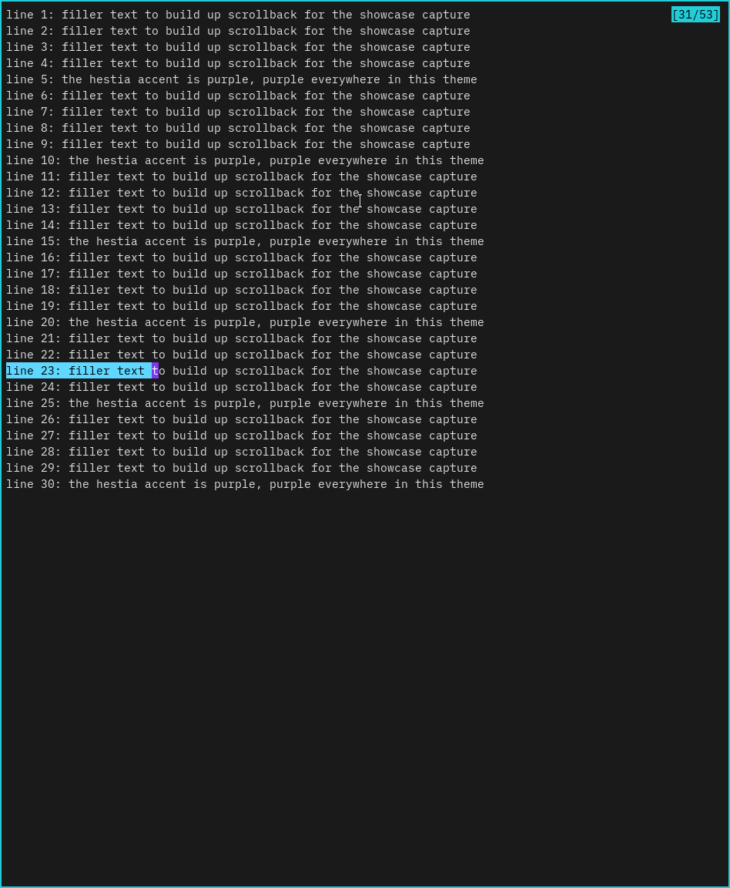
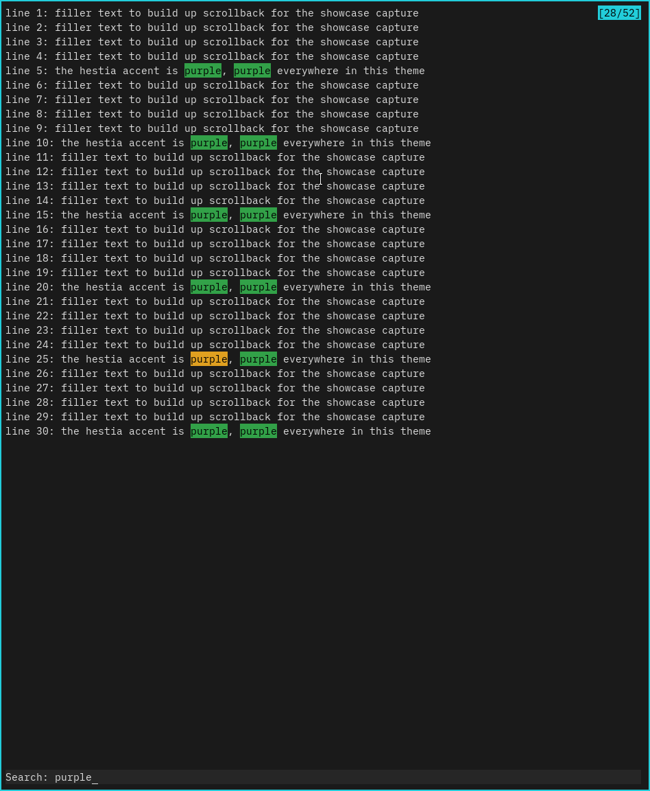
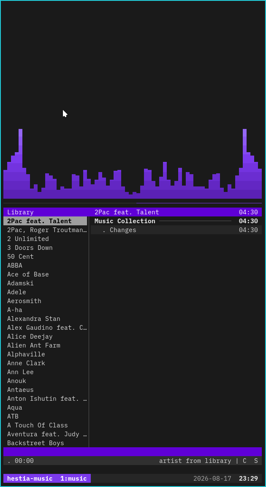

# Terminal emulators: reopening a constraint that no longer holds

kitty had been hestia's terminal since before hestia had a name for
"evaluation" — but it was never really *chosen*, it was the runner-up in a
two-horse race that was decided by a single constraint. The original
preference was **Alacritty**, mainly for its built-in **vi mode**: a
keybinding that drops the scrollback into a vim-like navigation/search/select
state (`hjkl`, `/`, `n`/`N`, visual selection) without shelling out to a
pager. Alacritty lost anyway, because at the time the file-manager pick was
ranger, and ranger's in-pane image previews need a terminal graphics
protocol — Alacritty implements none (no kitty protocol, no Sixel), kitty
does, so kitty won by default and ranger came along as the file manager that
made it work.

That constraint is gone. The file-manager evaluation's verdict was **vifm**,
and vifm's image story doesn't run through an in-terminal protocol at all —
opening an image spawns **imv** in a tiled Wayland pane next to vifm (see
[vifm.md](vifm.md), [file-managers.md](file-managers.md)). Nothing about
vifm's primary workflow needs kitty's graphics protocol. The one place it's
still load-bearing is **ranger**, a themed-but-not-default runner-up
(`preview_images_method kitty` in `user/ranger/rc.conf`) — real, but not a
reason to keep the default terminal pinned, the same way ranger surviving
as an alternative didn't stop vifm from winning file managers.

## The contenders

Scoped deliberately narrow — testing every terminal emulator in existence
(GNOME Terminal's whole GTK/VTE family, Konsole, every other GPU-accelerated
Rust/C entrant) would be evaluation for its own sake. Four candidates were
opened; the headline question (does Alacritty's vi mode beat kitty enough to
retake the default) got a full live trial and a verdict, while foot and
GNOME Terminal never actually got tested — see *Honest scope* below.

| App | Kind | Verdict |
|---|---|---|
| **Alacritty** | GPU-accelerated (OpenGL), Rust | **Winner — the new default.** Built-in vi mode (vim-style scrollback navigation/search/select, no external pager) was the deciding feature; themed to match `hestia.vim`'s own highlight groups, not just the accent (`user/alacritty/`) |
| **kitty** | GPU-accelerated (OpenGL), C + Python kittens | Runner-up, **kept + themed**. No cited technical flaw — still needed for ranger's graphics-protocol image previews and `$mod+m`'s music session (its `--session`/layout feature, no Alacritty equivalent) |
| **foot** | Wayland-native, C, CPU/software-rendered | **Untested.** Was going to be the "does this even need a GPU" check; the headline criterion got answered by the kitty/Alacritty comparison alone, so this never got run |
| **GNOME Terminal** | GTK3/VTE | **Untested.** Was going to be the GUI-onboarding option (Nemo's role, among file managers); same story — not reached |

**Honest scope.** This is a partial verdict, not a fudged complete one. The
roadmap process (`docs/roadmap.md`, "How an evaluation runs") says gate 4 is
met when "contenders were trialled and a verdict + rationale is recorded" —
that happened for the actual motivating question (kitty vs. Alacritty, vi
mode), but foot and GNOME Terminal stayed in the opt-in `terminal_emulators`
apt group (`enable_terminal_emulators`, default off) as an honestly-unfinished
tail rather than being declared "kept" or "dropped" without ever having run.
Pick that comparison back up if it's ever wanted — same shape as the
file-manager evaluation, where losing candidates only get dropped for a
*cited* technical reason, never by default.

## The ride

The trial started from a real personal history, not a synthetic bake-off:
Alacritty was the original preference specifically for vi-mode scrollback
search/select, dropped years ago only because ranger (the file manager at
the time) needed a graphics protocol Alacritty didn't have. Once vifm's
imv-based image story removed that constraint, the question became "is
there still a reason not to switch back" — and the answer was no.

**Round 1 — theming, the wrong way first.** Alacritty had no config at all
in the repo, so the first pass built `user/alacritty/alacritty.toml` +
`theme-{dark,light}.toml` from scratch: same font/padding/scrollback as
kitty (a fair baseline), colours pulled from `palette.yml` by hand (same
"hand-authored, not yet a `render.py` target" tier as tmux/zellij), vi-mode
cursor given its own `accent_dark` shade plus an `Underline` shape so the
mode would be visibly different from normal. Verified by parsing both
variants with `alacritty --config-file … -e true` (zero warnings) and a
live screenshot of the base colours.

**Round 2 — "make it work like vim."** The generic accent-everywhere
theming wasn't the actual goal — the ask was to reproduce hestia.vim's own
semantic distinctions: cyan for `Visual` selection, purple for the cursor,
orange while actively searching, green once the search is confirmed. That
sent the trial back into `user/vim/colors/hestia.vim` for the literal
highlight-group values (not a guess): `Visual` is `gui=reverse`, which
unpacks to a `#5fd7ff` cyan fill with black text on dark (`#0087d7`
blue/white on light); `Search` (persistent, all matches) is green
(`syntax.string`); `IncSearch`, linked from `CurSearch` (the match the
cursor is actually on), is orange (`syntax.type`). The insight that made
this click: Alacritty's own `search.matches`/`search.focused_match` split
isn't "active vs. inactive" like zathura's search highlighting — it's
"every match" vs. "the one the cursor is on," which is *exactly* vim's
`Search`/`CurSearch` split. Verified by actually driving Alacritty's vi mode
with `wtype` (Wayland keystroke injection) and screenshotting both the
live-typing state and the post-Enter state — see *Screenshots* below.

**Round 3 — the cursor, twice reverted.** The vi-mode-cursor distinction
went through three shapes before landing: first an `Underline` shape in the
darker `accent_dark` colour — caught live as "almost invisible, I'm not
sure why it's darker" (a thin underline in deep purple on a dark ground
reads as nothing). Reverted to `Block` shape, same `accent_dark` colour —
still wrong, this time because a colour-only difference just reads as "a
random darker purple" rather than a deliberate signal. Final answer: **no
difference at all** — same `#7c3aed`, same `Block`, in both modes. The mode
is already obvious from context (what you just pressed, the line indicator,
search behaviour); trying to encode it into the cursor twice made things
worse each time before the fix was "stop trying."

**Round 4 — the line indicator and a real bug caught by testing, not
guessing.** A late ask ("make the line indicator cyan") led to actually
driving vi mode live for the first time (`wtype` + `swaymsg -t get_tree` +
`grim`), which caught something no amount of reading the TOML would have:
the music-session rebuild (below) had `tmux select-pane -t "$SESSION:music.1"`
hardcoded, and on one test run that selected **cava's pane, not cmus's** —
because `pane-base-index` is a *user* tmux setting (hestia's own
`.tmux.conf` sets it to `1`), so a literal `.1` target is fragile and
session-state-dependent. Fixed by removing the explicit `select-pane`
entirely: `split-window`'s new pane becomes active automatically, so the
hardcoded index wasn't needed at all — the bug and the fix were both found
by actually running the thing, not by re-reading the script.

**Round 5 — promoted to GENERATED, and it caught a real inconsistency.**
Once the theme was confirmed working, the obvious next question was why
tmux/zellij/Alacritty were still hand-authored (values manually copied from
`palette.yml`) when every other themed app — kitty, vifm, waybar — is
mechanically rendered by `themes/hestia/render.py`. There wasn't a good
reason beyond "they were new"; converting them meant writing
`render_tmux()`/`render_zellij()`/`render_alacritty()` and diffing every
generated line against the hand-authored original before touching
`OUTPUTS`. That diff caught something the eye had missed: the light
variant's `search`/`selection`/`line_indicator` foreground was `#ffffff`
(white), not the `#000000` (black) the dark variant used — a real,
deliberate asymmetry (light's fills need white text for contrast, and the
line indicator's background is the *base* `cyan` on light rather than
`bright_cyan`, specifically because base cyan contrasts better with white
text) that a naive "just use `ink` everywhere" first draft of the generator
would have silently flattened into a bug. Caught by diffing against the
real file before wiring it in, not by trusting the refactor. Along the way,
vim's own `Visual` colour (`#5fd7ff` dark / `#0087d7` light) — previously a
`render_vim()`-only literal, documented as having "no cross-app role" —
became a genuine shared value once Alacritty needed it too, so it was
promoted to `palette.yml` as `extended.visual` rather than duplicated as a
second hardcoded literal. `render.py --check` now covers all three
(42 artifacts total, up from 36).

## How hestia ships it

**The default swap** touches every place sway/waybar spawn a terminal, not
just `$mod+Return`:
- `set $term alacritty` (`user/sway/config`) — the primary terminal bind
- Every waybar floatterm popup (gpu, bluetooth, network, cpu/memory→htop,
  notifications, weather) and the `pulsemixer`/USB-mount-vifm launchers
  (`user/waybar/config`, `scripts/audio.sh`, `scripts/usb.sh`)
- The `$mod+c` qalc calculator popup
- nemo's "Open in Terminal" (`user/sway/nemo-setup.sh`)

One side effect worth calling out: kitty's own "still running, close
anyway?" confirmation dialog — which every sway-tree floatterm toggle had to
work around with `-o confirm_os_window_close=0` — doesn't exist in
Alacritty at all. Switching the default didn't just rename a binary in a
dozen places, it deleted a whole workaround.

**The theme** (`user/alacritty/theme-{dark,light}.toml`, **GENERATED** by
`render_alacritty()` in `themes/hestia/render.py` — see Round 5 below) maps
every vi-mode surface to the matching `hestia.vim` highlight group:
`[colors.selection]` = `Visual`, `[colors.search.matches]`/
`[colors.search.focused_match]` = `Search`/`CurSearch`, plus a `bright_cyan`
(dark) / base-`cyan` (light) line indicator and a footer bar on the raised
`surface` colour. The cursor is deliberately *not* mode-specific (see Round 3
above) — same accent, same shape, always.

**The music session** (`user/alacritty/music-session.sh`, bound to
`$mod+m`) replaces kitty's native `--session`/layout feature, which
Alacritty has no equivalent of. Rather than invent a new mechanism, it
composes two defaults hestia already has: **tmux** (the terminal-multiplexer
evaluation's own winner) provides the split — cava on top, cmus below
(`split-window -v -p 70`) — and a fixed session name (`hestia-music`) with a
`tmux has-session` guard means a second `$mod+m` **attaches** the running
session instead of stacking a duplicate (kitty's original binding had no
such guard — this is a genuine improvement, not just a port). Quitting cmus
runs `tmux kill-session`, tearing the whole window down together, same as
the kitty version.

## Gotchas

- **`--class` and `-e` are drop-in identical to kitty's flags** (`man 1
  alacritty`) — every `kitty --class X -e Y` in the repo became
  `alacritty --class X -e Y` with no other changes needed. The one flag that
  *doesn't* carry over is kitty's `-o confirm_os_window_close=0` — Alacritty
  has no matching option because it has no close-confirmation dialog to
  suppress in the first place.
- **A refactor's diff is the actual QA step, not a formality.** Promoting
  the hand-authored theme to a `render.py` generator (Round 5) meant a first
  draft that used one "black on dark, ??? on light" rule for every fill's
  foreground — comparing its output line-by-line against the real file
  caught that light actually needs white text (and a darker cyan for the
  line indicator specifically to keep contrast with that white text), an
  asymmetry that was invisible from reading the generator code alone but
  obvious the moment its output was diffed against ground truth.
- **Alacritty's own bundled terminfo already has working SGR mouse**
  (`infocmp -x alacritty` shows `XM=`/`kmous=\E[<`) — unlike kitty's stock
  `xterm-kitty` entry, which needed a whole tracked terminfo override
  (`user/kitty/xterm-kitty-sgr-mouse.terminfo`, see `CLAUDE.md`'s Kitty
  section) to get vifm's scroll wheel working. Nothing extra was needed for
  vifm's wheel to work under Alacritty.
- **The SSH `TERM` fix needed generalising, not just kitty's alias.**
  `user/bash/.bashrc` downgrades `TERM` before `ssh` so remote servers
  without the local terminal's terminfo entry don't garble backspace/arrows —
  but the existing alias only checked `[ "$TERM" = xterm-kitty ]`. Under
  Alacritty (`TERM=alacritty`) it silently didn't fire, reintroducing the
  exact bug it was written to prevent. Caught by re-reading the file for
  every `kitty` reference, not by hitting the bug live — a `case` statement
  covering both terminals replaced the single check.
- **`pane-base-index` made a hardcoded tmux pane target fragile** — see
  Round 4 above. General lesson: don't address a tmux pane by a literal
  index when the index's meaning depends on a setting (`pane-base-index`)
  that a user's own `.tmux.conf` can and does override; prefer relying on
  tmux's own default behaviour (the newly split pane becomes active) instead.
- **A "make it visibly different" instinct isn't automatically right.**
  Two separate attempts to give the vi-mode cursor its own visual identity
  (a shape change, then a colour change) both made things worse and were
  both reverted after being seen live, not reasoned about in the abstract —
  see Round 3. Verify a "this will help legibility" change by actually
  looking at it before committing to the reasoning behind it.

## Screenshots

Dark variant (`theme_variant: dark`), all captured by actually driving
Alacritty's vi mode with `wtype` + `grim` rather than reading the config:

