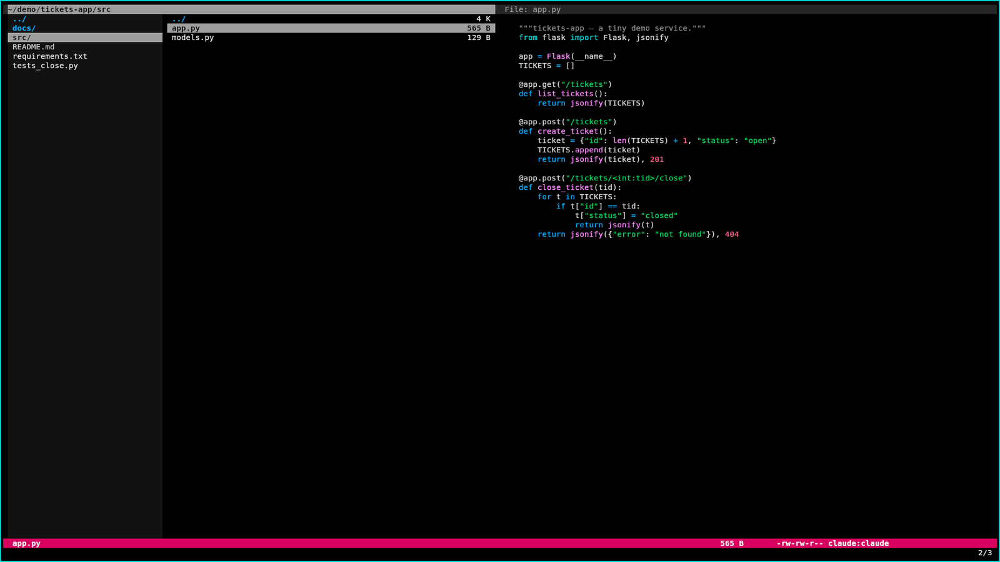
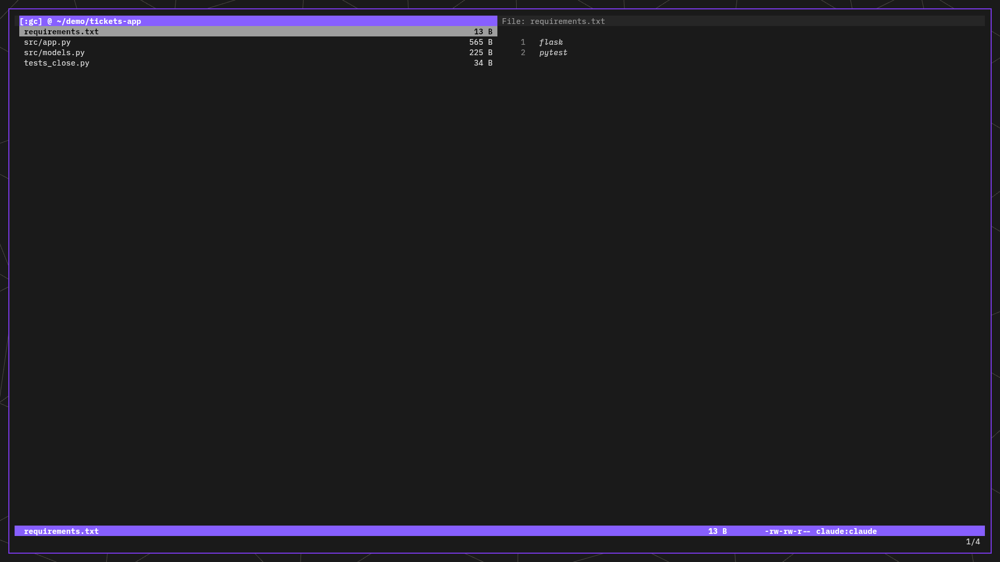
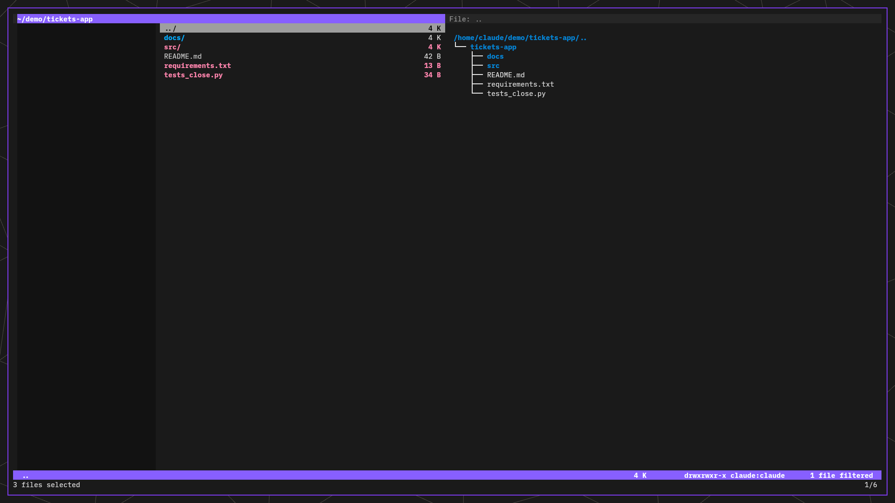
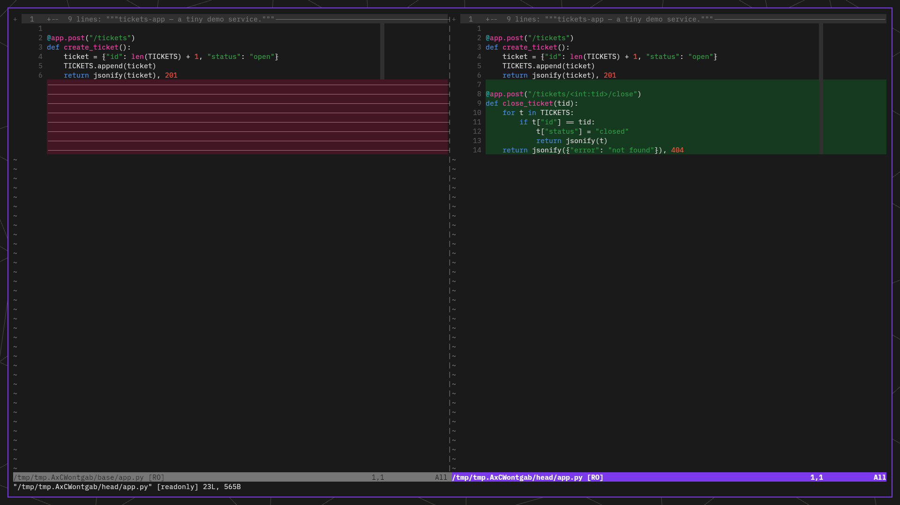
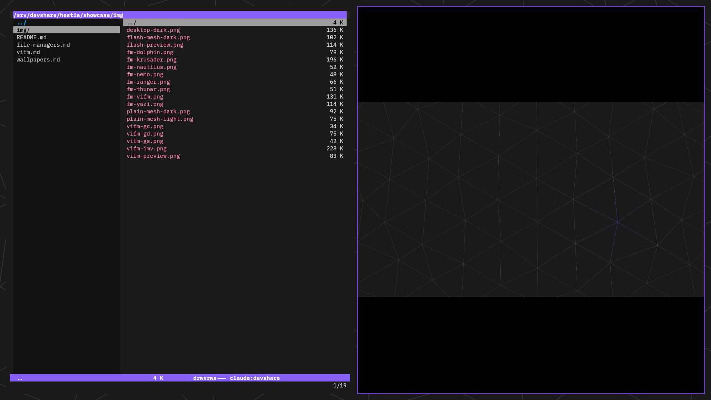

# vifm in hestia: the integration, in detail

The [file managers chapter](file-managers.md) calls vifm's integrations "the
moat" — the accumulated wiring no challenger replicates without years of
config. This page is that moat, itemised: what the integrations actually do,
with live examples. Everything shown is driven by `user/vifm/vifmrc` and its
three scripts; every screenshot is the shipped config doing its thing.

## The layout: a ranger triple at vifm speed

Two settings produce the layout the file-manager trial made desirable:
`set millerview` with `milleroptions=lsize:1,csize:2,rsize:0` draws a slim
parent-context column left of the file list, and the quick-view pane (`w`)
fills the right third. Reading left to right: *where you came from → where
you are → what the cursor is on*. The preview pane dispatches by type:

| Under the cursor | Rendered by |
|---|---|
| code / text | `bat` (wildcharm theme — same syntax table as vim, the web, VS Code) |
| Markdown | `glow` (forced-colour through the pipe; a 16-colour approximation of the theme) |
| directories | `tree -C`, two levels, driven by the same `LS_COLORS` as `ls` — so the tree, `ls`, and vifm's own file-type colours agree by construction |
| PDFs | `pdftotext` |
| images / video / audio | `mediainfo` — *info*, deliberately not pixels (that's the imv bridge below) |

The lattice of small decisions here is where the years live. One example: the
catch-all fileviewer passes `%c:p` (absolute path of the file under the
cursor), not `%f` — because on the `..` entry `%f` expands to *nothing*, which
used to shift a pane-geometry argument into the preview script's `$1` and
produce the immortal error `cannot open '48'`.

## The git suite: your branch as a working set

The everyday question inside a repo is "what am I actually touching on this
branch?" — four commands make vifm answer it natively. All of them
auto-detect the base (`main`, falling back to `master`) and accept an
optional base ref (`:gd origin/main`) when you need a different comparison.

**`gc` — the branch's files as a jump list.** One keypress builds a custom
view containing exactly the files this branch changed relative to base.
Enter opens; `gr` (repo root) or the built-in `gh` exits back to normal
browsing:

**`gs` — the same set, highlighted in place.** Instead of replacing the view,
`gs` *selects* the changed files — and the directories on the way to them —
inline in the normal browser. And because it reuses vifm's selection
machinery, the highlighted set is immediately actionable: `yy` copies it,
`dd` cuts it, any file operation applies to it.

**`gd` — diff the cursor file against the base.** From the normal browser
*or* from a `gc` list, `:gd` extracts the merge-base and HEAD versions of the
file under the cursor and opens a read-only side-by-side vimdiff. New code
green, removed code red, unchanged regions folded:

The suite looks small; the constraints it navigates are the real story, and
they're documented in the vifmrc for the next maintainer: a literal `|` in a
vifm `:command` is a command separator, so anything with a pipeline lives in
`git-changed.sh` rather than inline; vifm clears selections on directory
load, so `gs` is a keypress rather than an autocmd (which would never stick);
a macro wrapped in single quotes is *not* expanded, so `:gd` passes bare
`%c:p`; vifm 0.14 has no `trim()`, so the repo-root command strips a trailing
newline with `tr` in-shell; and `gh` is a built-in *key*, not a command, so
`:gh` exists as a `:normal!` alias for the muscle-memory typo.

## The imv bridge: full-screen media without leaving the browser

vifm's preview pane cannot render pixels on this stack — the kitty graphics
protocol in-pane was tried twice and reverted both times. Instead of settling
for a worse preview, hestia wires a second program *into* vifm's navigation:

Opening an image (or video) runs `imv-browse.sh`: vifm collapses to a single
pane, sway splits, and **imv opens tiled beside it** on the folder's media,
started at the cursor file. The wiring underneath is the deep part:

- **The cursor follows both ways.** Every `j`/`k` inside imv tells vifm to
  `:goto` the corresponding file — select *without opening* (a plain remote
  open would relaunch imv in a loop). Every message targets the launching
  vifm instance by server name; a bare `--remote` reaches whichever vifm
  registered first, which live-debugging proved is rarely the one you meant.
- **`q` restores the world** — the dual-pane preview layout comes back, the
  cursor lands on whatever you were last viewing. **`h`** goes one directory
  up — computed from the *image's* path, not vifm's cwd, because you may
  have wandered elsewhere while imv was open.
- **Videos ride along as ▶ posters.** imv can't play video, so the script
  feeds it cached poster thumbnails with a play-button overlay; a session map
  resolves every imv index back to the real file. Posters are generated
  *cursor-first*: only the selected file's poster is made synchronously, the
  rest show a generic ▶ tile while an idle-priority worker backfills the
  cache — so a 2000-video directory opens as fast as a 5-video one. **Enter on a video opens
  mpv tiled below** — single-instance and debounced, because focus returning
  to imv used to re-fire the bind and fork-bomb mpv (a PID-checked lock plus
  a ~2-second cooldown absorbs the spurious re-fires).
- **Re-opening is idempotent** — another Enter in vifm retargets the running
  imv instead of stacking a second window.

## The small conveniences that add up

- **Audio plays now, not later**: Enter on a track sends it to a running cmus
  (`cmus-remote -f`); no cmus, it falls back to `mpv --no-video`. The `:file`
  menu offers queue-instead and mpv-explicitly.
- **Yank into the GUI clipboard**: `yd`/`yf` put the directory or file path
  on the Wayland clipboard via `wl-copy`.
- **Everything opens somewhere sensible**: PDFs → zathura, office documents →
  LibreOffice, Markdown → glow as a full-screen pager (with "edit in vim" on
  the menu).

## Why this is the moat

None of these pieces is spectacular alone. Together they mean vifm is not "a
file manager hestia installed" but *the hub the other tools are wired into*
— git, vim, imv, mpv, cmus, the clipboard, the previewers, all reachable
from the same four navigation keys. A challenger doesn't have to beat vifm's
speed; it has to beat vifm's speed *plus* this page — and its own version of
this page starts from zero. That's the argument the
[file managers verdict](file-managers.md) compresses into one word: moat.

## Where it lives

- `user/vifm/vifmrc` — the config; the git suite and openers, with the
  constraint notes inline
- `user/vifm/scripts/` — `preview.sh` (the dispatch table),
  `git-changed.sh` (the pipeline half of `gc`/`gs`), `imv-browse.sh` (the
  bridge launcher)
- `user/imv/config-vifm` + `user/imv/imv-vifm-return.sh` — imv's side of the
  bridge (dedicated config; standalone imv stays stock)
- `user/vifm/colors/` — the generated wildcharm pair
