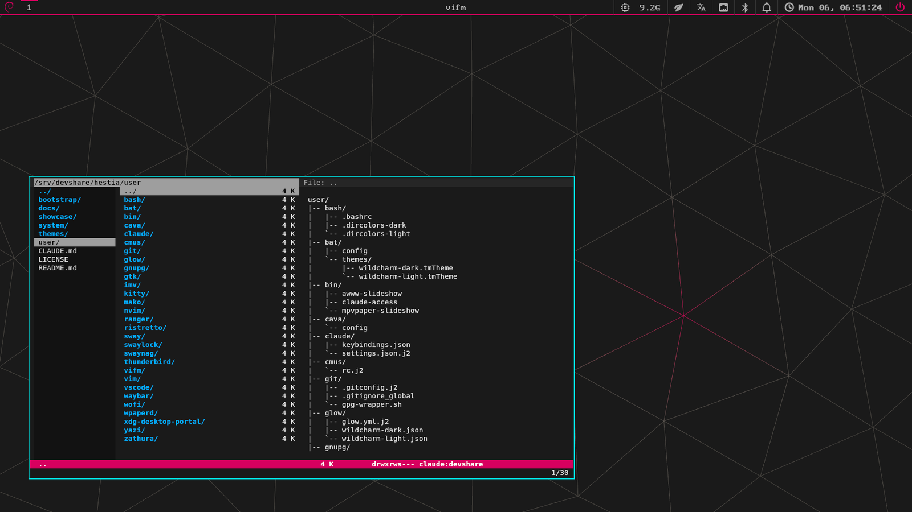
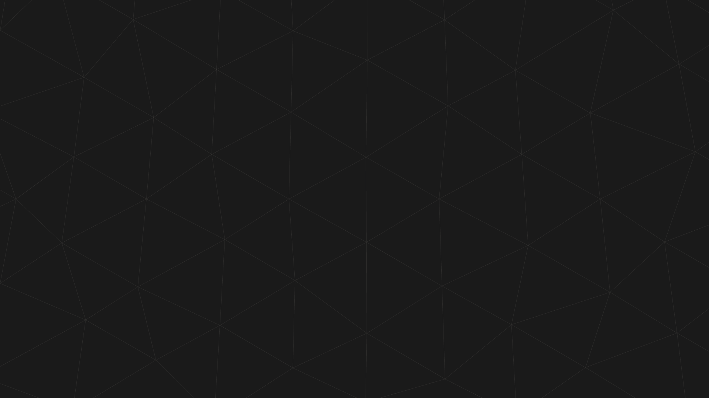
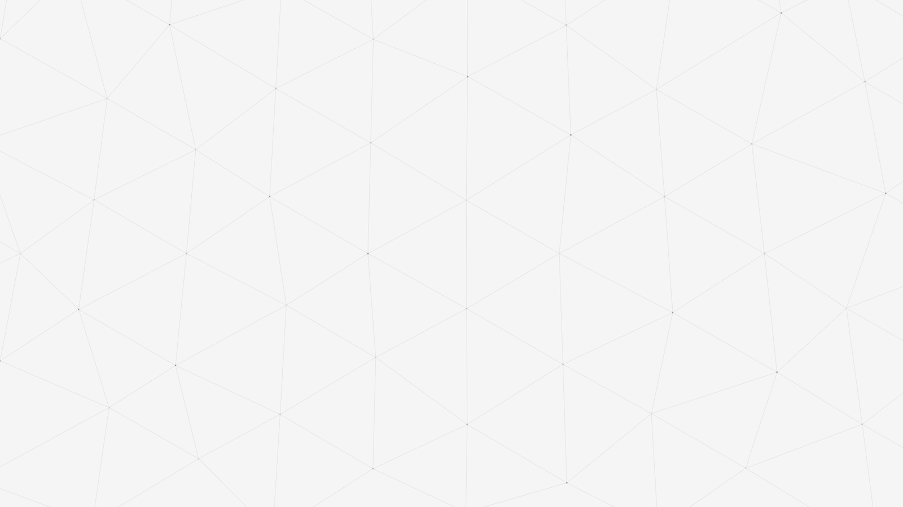
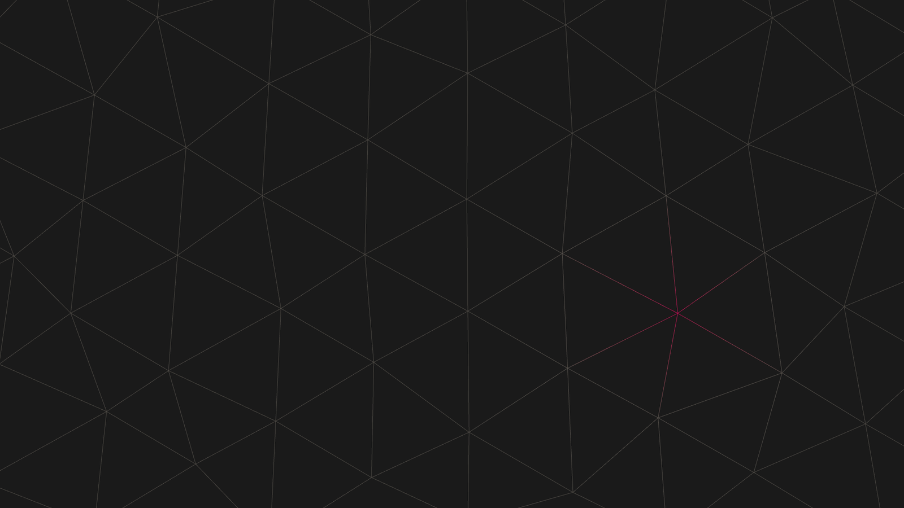
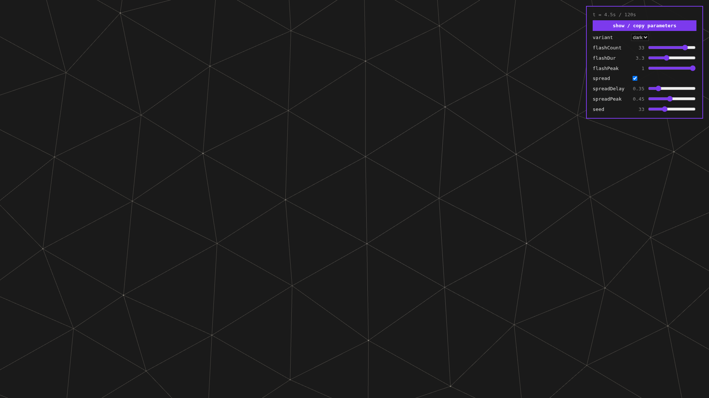

# Wallpapers: from "no wallpaper story" to a generated mesh

Until mid-2026, hestia's desktop background was a solid colour — the theme's
ground (`#1a1a1a` dark, `#f5f5f5` light), painted by sway's own `output * bg`.
Deliberate minimalism, but it left a real gap: a distributable spin needs a
wallpaper *story* — engine, content, and licensing — and lots of users simply
want one. This is the ride that filled the gap, and it ended somewhere better
than "pick a nice photo": the default background is now **rendered from
hestia's own design system**, seamlessly looping, in both theme variants.

## The contenders

None of the interesting tools is in Debian's archive, and none publishes
prebuilt binaries — so hestia builds them once and ships them as
sha256-pinned assets on a GitHub release (the same pattern as the Yaru icon
theme). All three survived the trial and install together behind one toggle
(`enable_wallpapers`); they cover different jobs:

| Tool | Verdict | Why |
|---|---|---|
| [wpaperd](https://github.com/danyspin97/wpaperd) | **kept — and now the default engine** | per-output config, `duration` slideshows over a directory, hardware-accelerated transitions, `wpaperctl` IPC; low, *flat* memory — it paints the static mesh frame (see the epilogue) |
| awww (successor of the archived [swww](https://github.com/LGFae/swww)) | **kept** — the transition play | animated wipes/grows on demand (`awww img`), GIF support; no native slideshow — hestia's `awww-slideshow` wrapper fills that |
| [mpvpaper](https://github.com/GhostNaN/mpvpaper) | **was the default; dropped as engine** (still installed) | video wallpapers via libmpv; made the mesh *move* — but its looping decode leaks memory without bound (upstream mpv bug; see the epilogue), so it lost the default slot |
| swaybg | baseline | static, no IPC, no slideshow; remains the solid-ground fallback |

One candidate never made the table: **swww**, the community favourite, was
archived upstream in October 2025 mid-evaluation research. Its maintained
successor awww took its slot — a reminder to check pulse, not reputation.

## The ride

**wpaperd** went first and nearly ended the trial early: point a TOML section
at a directory, set `duration = "30m"`, and every output gets its own
independently-timed slideshow. It expands `~` in config paths itself, so the
config ships as a plain tracked symlink. Then came the trial's defining
surprise: `wpaperctl status` said `running (27m left)` on both monitors while
the desktop stubbornly showed the solid colour. The daemon was healthy,
painting frames — **behind** sway's own swaybg. Both live on the same
background layer, and their stacking order is timing-dependent: in headless
tests the wallpaper daemon landed on top; live, swaybg won. `pkill -x swaybg`
became the trial mantra — and designing that race away shaped the final
wiring (below).

**awww** brought the eye candy — animated transitions on every image switch —
and two wrapper lessons. hestia's `awww-slideshow` script initially fed awww
*every* file in the wallpaper directory; real collections carry `.xmp`
metadata sidecars, awww correctly refused to decode XML, and the wrapper died
on the first one. The fix (an image-extension whitelist plus
skip-don't-abort) applies to any tool that walks a media directory. Second
lesson: `awww img` paints *all* outputs the same image unless told otherwise
— per-monitor variety means querying outputs each tick and dealing each one a
different card from one shuffled deck (independent `shuf`, because two
instances of a library shuffle can deal the same order).

**mpvpaper** closed the trio: wallpapers through a full mpv, so video just
works, images hold via `--image-display-duration`, and a directory mixing
both becomes a slideshow with its native `-n` timer. Different videos per
monitor took one more wrapper (`mpvpaper-slideshow`: one instance per output,
each with its own shuffled playlist). Its honest cost: continuous decode —
CPU/GPU spent forever, the number to watch on the Waybar GPU widget.

### The verdict that changed the question

Ranked as wallpaper tools: wpaperd best default, awww equal but
wrapper-dependent, mpvpaper the power tool. But the real verdict replaced the
question. hestia's sibling project ships an **ambient web lattice** — a
three.js honeycomb that breathes behind the page, designed for dark and light
— and if the background could *be* that, the wallpaper stops being stock
content and becomes an artifact of the design system: palette-true,
variant-wired, licensing-clean, reproducible. That takes video. **mpvpaper
became the default engine because the mesh became the default background.**

### Epilogue: the leak that re-picked the engine

A month in, the video default showed its cost — not CPU, but **memory**.
`mpvpaper` playing the 4K loop climbed to **~14 GB RSS after three days**, still
rising ~10 GB/day, monotonically. It isn't a hestia misconfiguration: a looping
video in mpv leaks unboundedly on current versions — an unfixed upstream
regression ([mpv #15099](https://github.com/mpv-player/mpv/issues/15099),
absent in mpv 0.32, present since 0.35; surfaced through mpvpaper by
[mpvpaper #101](https://github.com/GhostNaN/mpvpaper/issues/101)), and it bites
harder the larger the frame — 4K is the worst case. A wallpaper is a *permanent*
player, so the leak has forever to run; the common community answer is a cron
that restarts the daemon, which is a smell, not a fix.

So the engine went back to the runner-up. Every mesh render already ships a
**static t=0 PNG** beside its loop (they were there for `swaybg` and no-video
spins all along), and **wpaperd** paints stills at flat, negligible memory.
`user/sway/wallpaper.sh` now generates a per-output wpaperd config
(`wpaperd -d -c …`, one section per output pointing at that output's
best-resolution mesh PNG) instead of spawning an mpvpaper per output. The
desktop looks all but identical — the mesh is a slow, near-still breathing
lattice, so a frozen frame of it reads as the same wallpaper minus the drift —
and the RSS graph is a flat line. The lesson for the catalog: **a verdict isn't
final; a "closed" gate can reopen when a tool's real cost only shows up at
runtime, over days.** mpvpaper stays installed (the power tool for deliberate
video wallpapers), just not as the always-on default.

## plain-mesh: the base flavour

The lattice's motion is pure sinusoids of time — no randomness — which makes
a *perfect* loop possible: snap the three motion frequencies to integer
cycles of a 120-second period and frame 2879 flows into frame 0 like any
other frame (measured: the wrap-around frame delta equals a normal
adjacent-frame delta). The render harness (`themes/plain-mesh/`) drives the
scene frame-by-frame with a deterministic clock in headless Chromium —
never wall-clock capture — so renders are repeatable and any resolution is a
viewport size. Six resolutions × two variants, encoded at x264 crf 14
(quality over size: with thin lines, banding is the enemy), published as the
`plain-mesh-v1` release with a static t=0 PNG beside every loop — the stills
serve wpaperd, swaybg, and any no-video spin.

At the sway end, `user/sway/wallpaper.sh` runs as `exec_always` from the
generated theme fragment: per output it picks the exact-resolution PNG (or
the largest available — `fill` scales cleanly), writes a per-output wpaperd
config and starts the daemon idempotently, and **retires swaybg** — re-running
on every reload, which matters because reload *respawns* swaybg above the
wallpaper layer. That's the trial's stacking race, solved by construction. No
assets or no wpaperd? The script no-ops and the solid ground stays — nothing
breaks on a lean spin. (This paragraph describes the current static-PNG engine;
the video path it replaced is the epilogue above.)

## flash-mesh: the first flavour — and the default

Flavours extend the family as `<flavour>-mesh`: same lattice, new behaviour,
own release tag, selected per host by one variable (`wallpaper_flavour`; the
quiet plain-mesh remains the no-flash alternative). The first is
**flash-mesh** — promoted to hestia's default within a day of shipping:
every few seconds a node ignites in the accent (`#d7005f`),
fast attack, smooth decay, the pulse bleeding one hop down its web edges at
reduced strength. Deterministic and loop-periodic like everything else — a
seeded schedule of events evaluated on wrapped time deltas.

The tuning flow is the nicest part: the *same scene module* that bakes the
videos also builds a **live browser preview** — a single self-contained HTML
(three.js inlined) with sliders for every parameter and a copy-parameters
button. Tune by eye, paste the JSON, and those exact values bake into the
release. What you previewed is what loops on the desktop, by construction.

One bug earned its place in the design: the first flash implementation picked
nodes uniformly across the lattice — which deliberately overfills the frame
so the drift never exposes an edge — and most flashes fired *offscreen*.
Events now only pick nodes that project comfortably inside the viewport,
computed per aspect ratio, so portrait renders get their own visible set.

## Gotchas, for the record

- **Background-layer stacking is timing-dependent.** swaybg vs any wallpaper
  daemon: whoever maps later wins, and `swaymsg reload` respawns swaybg on
  top. Don't fight the race — have the reload hook kill swaybg.
- **wpaperd looks broken while working**: `wpaperctl status` says `running`
  even when its surface is buried under swaybg. Check stacking before
  debugging the daemon.
- **Media directories contain non-media** (`.xmp` sidecars): whitelist
  extensions, skip failures, only abort on *consecutive* failures (a dead
  daemon), or one bad file ends the show.
- **mpv shows images for 1 second by default** — in playlist wallpapers, pin
  `image-display-duration=inf` and let the slideshow timer advance.
- **Per-instance shuffle is not per-output variety**: two mpv instances can
  shuffle identically; deal from one externally-shuffled deck.
- **A wallpaper video is a permanent decoder** — and on current mpv a permanent
  *leak*: measure RSS over days, not minutes. Here it forced the engine back to
  static stills (the epilogue). Always ship the static fallback; it may become
  the main path.

## Where it lives

- Engine (wpaperd, static mesh PNGs) + slideshow wrappers: `user/sway/wallpaper.sh`, `user/bin/awww-slideshow`, `user/bin/mpvpaper-slideshow`
- Render harness + tuning page: `themes/plain-mesh/`
- Install wiring: `bootstrap/roles/wallpapers/` (assets), the `localbin`
  entries in `bootstrap/group_vars/all.yml` (binaries), `enable_wallpapers`
  (default on), `wallpaper_flavour` (per host)
- Releases: `wallpapers-v1` (binaries), `plain-mesh-v1` / `flash-mesh-v1` (assets)
